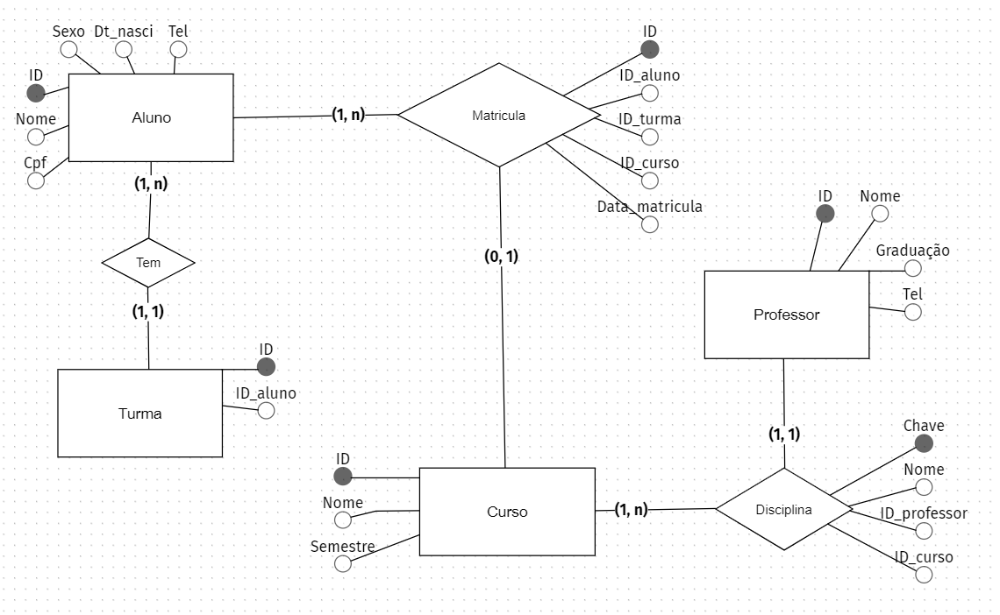
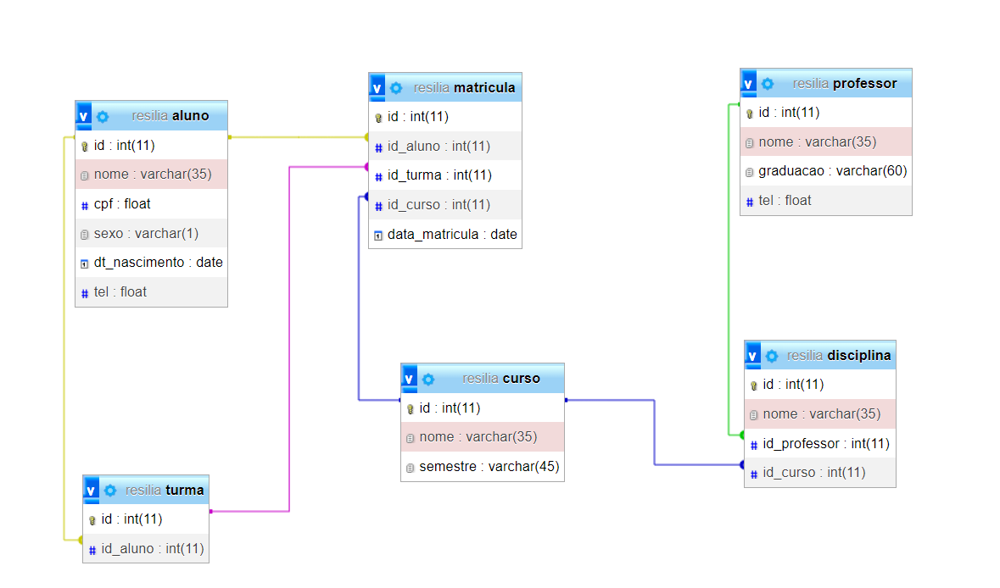

# SGBD - Resilia 📄

⇨ Existem outras entidades além dessas três?

>Sim!
 

⇨ Quais são os principais campos e tipos?
>ID do aluno, ID da matricula e ID da turma.(PK, PK, PK)
 

⇨ Como essas entidades estão relacionadas?

>Cardinalidades(1:N, N:1 ou 0:1)

 

## Screenshots 📸

